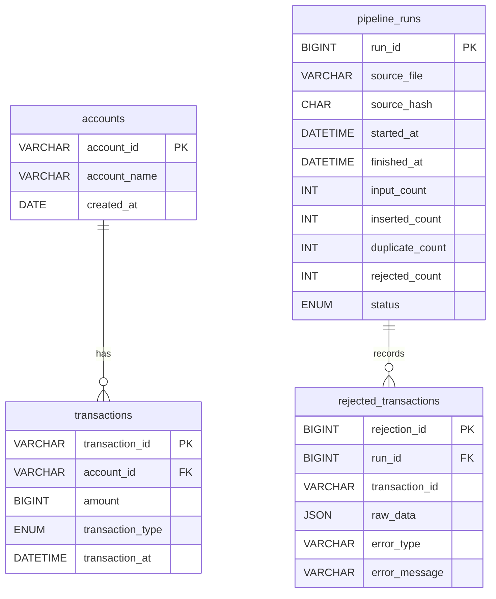

# FinOps Data Platform — ERD

```mermaid
erDiagram
    accounts ||--o{ transactions : has
    pipeline_runs ||--o{ rejected_transactions : records

    accounts {
        VARCHAR account_id PK
        VARCHAR account_name
        DATE created_at
    }

    transactions {
        VARCHAR transaction_id PK
        VARCHAR account_id FK
        BIGINT amount
        ENUM transaction_type
        DATETIME transaction_at
    }

    pipeline_runs {
        BIGINT run_id PK
        VARCHAR source_file
        CHAR source_hash
        DATETIME started_at
        DATETIME finished_at
        INT input_count
        INT inserted_count
        INT duplicate_count
        INT rejected_count
        ENUM status
    }

    rejected_transactions {
        BIGINT rejection_id PK
        BIGINT run_id FK
        VARCHAR transaction_id
        JSON raw_data
        VARCHAR error_type
        VARCHAR error_message
    }
```
